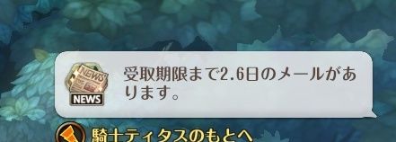
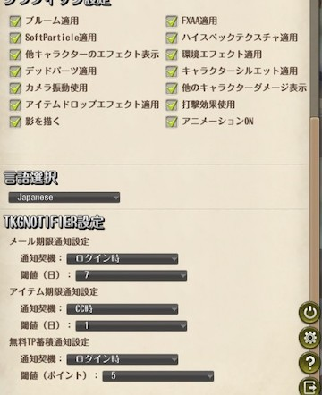

# tkgnotifier

## Descriptions

無駄になってしまいそうなものが手元にあったときに通知してくれるかもしれないアドオンです。



* ログイン時、メールボックスに期限が7日以内かつアイテム付きの未開封メールがあった場合に通知
* ログイン時、無料TPが5ポイント溜まっていた場合に通知
* CC時、インベントリに使用期限が1日以内の未使用アイテムがあった場合に通知

通知の頻度はある程度変更できます。[Configuration](#Configuration)を参照してください。

## Usage

v1.0.0からアドオンマネージャ経由でのインストールする形となりました。
すでに以前のバージョンを手動で導入済みの方は、古いファイルをdataフォルダから削除してからインストールしてください。

## Configuration

アドオンインストール後、システム設定画面に項目が追加されます。



設定内容は`<ToSインストール先>/addons/tkgnotifier/settings.json`に保存されます。

```json
{
  "mail": {
    "trigger": 1,
    "threshold_day":7
  },
  "item": {
    "trigger": 2,
    "threshold_day":1
  },
  "medal": {
    "trigger": 1,
    "threshold": 5
  },
  "locale": "JP" 
}
```

|キー1|キー2|型|内容|デフォルト値|
-|-|-|-|-
|mail||table|期限付きメール通知機能の設定|-|
||trigger|number|期限付きメール通知を行うトリガー|1（ログイン時）|
||threshold_day|number|期限付きメールの期限が近いと判断する閾値（単位:日）|7|
|item||table|期限付きアイテム通知機能の設定|-|
||trigger|number|期限付きアイテム通知を行うトリガー|2（CC時）|
||threshold_day|number|期限付きアイテムの期限が近いと判断する閾値（単位:日）|1|
|medal||table|無料TP蓄積通知機能の設定|-|
||trigger|number|無料TP蓄積通知を行うトリガー|1（ログイン時）|
||threshold|number|無料TPが蓄積したと判断する閾値（単位:ポイント）|5|
|locale||string|言語設定（"EN"または"JP"）|JP|

通知トリガーの内容は下記の通りです。

|設定値|通知タイミング|
-|-
|0|通知なし|
|1|ログイン時|
|2|ログイン時、キャラクター切替時|
|3|ログイン時、キャラクター切替時、マップ移動時|
|4|ログイン時、キャラクター切替時、マップ移動時、チャンネル切替時|

通知してほしくない機能に対しては、"trigger"に0を設定してください。
